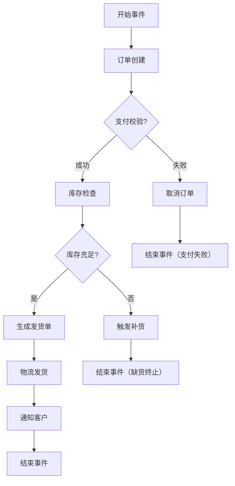
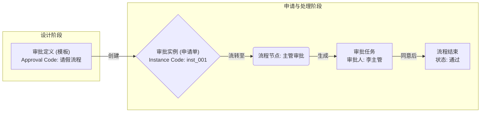
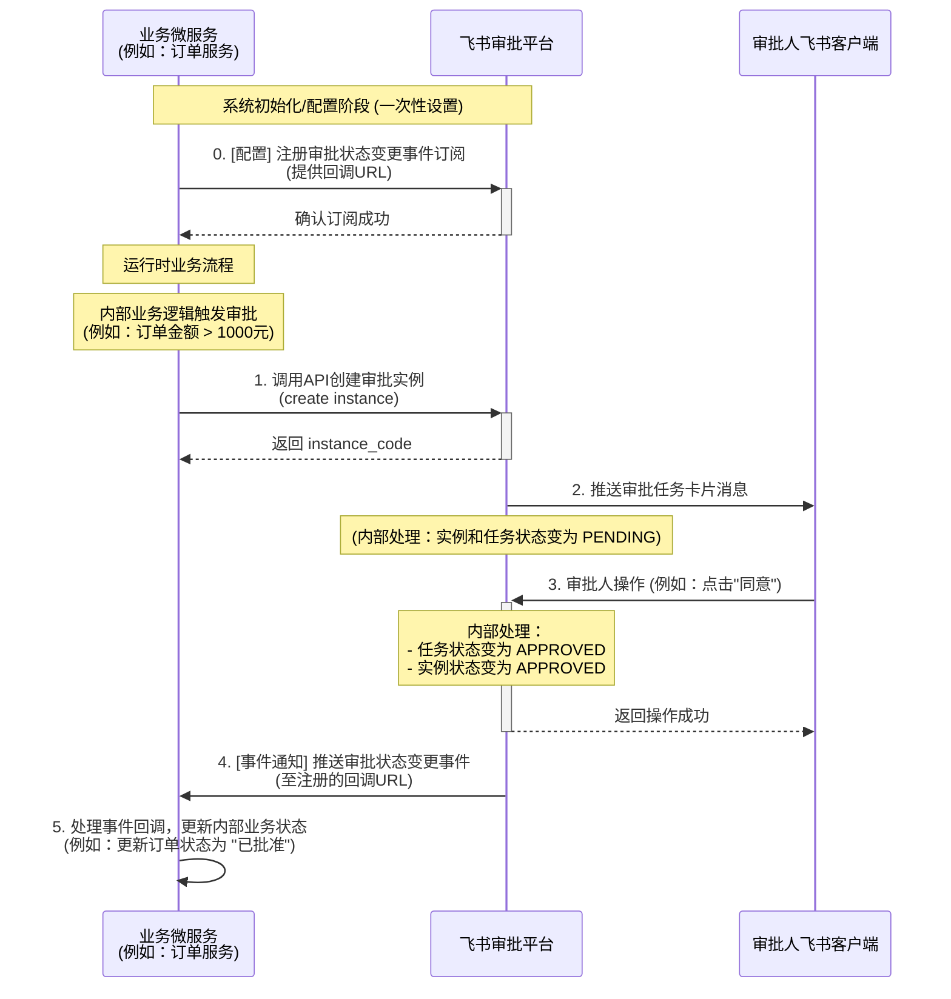
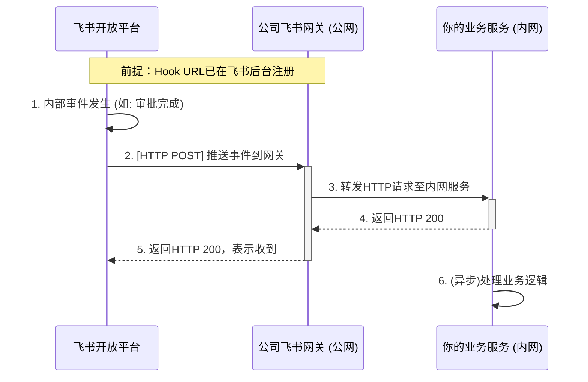
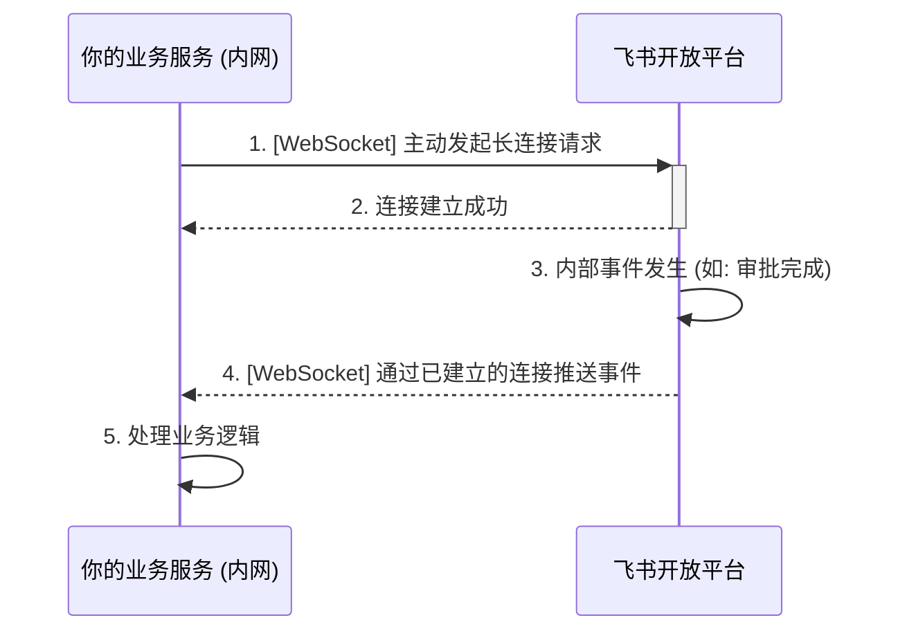

# 概述

飞书 是一款企业IM软件，但同时它也逐步的变成了企业OA平台。大家已经习惯了将各种事件通知、审批流程统一收拢到飞书。

飞书审批的概念和流程比较复杂，这个复杂度不是飞书带来的，而是审批流本身带来的。

本文希望帮助大家建立飞书审批流的认知。

# 审批流的概念

审批流是一个工作流，所谓的工作流一般就是一个DAG。用一个有向无环图来编排业务流程，业务事件驱动流程自动化的流转。

审批流在工作流的基础上，多了两点：

1. 流程中的每个节点，需要【审批人】来决策【通过】或【拒绝】。
2. 每个流程需要携带一些用于展示的表单数据，用来给【审批人】提供决策上下文。

总结来说，工作流可能就是一个自动化流程，一旦流程开始，可以自动化的进行，不需要用户参与。但是审批流的目的就是让【审批人】参与，审批流中的流程节点，就是让【审批人】来提交他的决策。

在日常开发过程中，总有围绕业务建设审批流程，推动单据状态流转的场景。一般来说我们有自建审批流程或集成飞书审批流程两个方案。

## 自建审批流程

审批流程就是一个工作流，只不过这个工作流需要由用户的审批动作来驱动状态变化。

如果要自建的话，我们要做的事情就是：

1. 【后端】选一个开源的工作流平台，结合具体设计、编排审批流程。这种的有很多，比较知名的比如：[Activiti/Activiti](https://github.com/Activiti/Activiti)
2. 【前端】围绕设计的工作流，建设匹配的前端UI。主要包含 表单展示、状态展示、流程展示、操作按钮
3. 【后端】集成IM平台，如飞书、钉钉，完成进度通知、结果通知等

## 飞书审批流程

飞书审批流程是一个平台化的SAAS服务，将业务无关的存储啊、通知啊、前端UI都做了统一的设计、封装。

我们只需要按业务来白屏化的拖拽设计好表单(低代码)，然后白屏化的设计好决策流程(工作流)，然后就可以【人工创建】审批或者使用【代码创建】审批了。

# 飞书审批的概念

在飞书审批的开放平台体系中，**审批定义 (Approval Definition)**、**审批实例 (Approval Instance)** 与 **审批任务 (Approval Task)** 是理解其流程三个核心概念。

简单来说，它们的关系可以类比为 **“模板”**、**“申请单”** 和分配给具体审批人的 **“待办事项”**。

## 审批定义(Definition) -- 设计和定义模板

**审批定义 (Approval Definition)** 是对一类特定审批事项的抽象和规范，它是一个可重复使用的 **模板**。在企业发起任何审批之前，管理员都需要先创建好对应的审批定义。

一个审批定义主要由两部分组成：

1. **表单 (Form)**：定义了审批申请需要填写的内容结构。它由一系列控件（如文本框、日期选择器、人员选择器等）组成，规定了用户需要提交哪些信息。例如，一个“请假审批定义”的表单可能包含“请假类型”、“开始时间”、“结束时间”和“请假事由”等字段。
2. **流程 (Process)**：定义了审批申请需要经过的流转路径。它规定了从申请提交开始，需要经过哪些审批节点（由谁来审批、会签还是或签），直到最终审批结束（通过或拒绝）。

每个审批定义都有一个全局唯一的 `approval_code`，作为调用 API 时指定模板的唯一标识。

## 审批实例(Instance) -- 基于模板实例化的流程

**审批实例 (Approval Instance)** 是用户基于某个审批定义（模板）发起的 **一次具体的申请单**。当员工填写完表单并点击“提交”后，系统就会生成一个审批实例。这个实例会承载着用户填写的全部数据，并作为一个整体，在预设的流程中流转。

每个实例都有一个全局唯一的 `instance_code`，用于追踪和操作这次具体的审批申请，也作为调用 API 时指定实例的唯一标识。

## 审批任务(Task) -- 审批人的决策任务

如果说“审批实例”是一张正在财务部和行政部之间流转的报销单，那么 **审批任务 (Approval Task)** 就是这张报销单流转到财务部时，系统派发给财务“张经理”的那个具体的 **“待办审批事项”**。

当一个审批实例流转到流程中的某个节点时，系统会为该节点指定的审批人创建一个或多个审批任务。

- **一对一**：如果节点审批人只有一个（例如“直属主管”），则会产生一个任务。
- **一对多**：如果节点审批人有多个（例如需要“三位总监会签”），则会为每位总监都创建一个专属的审批任务。

每个任务都对应一个具体的审批人，等待其完成“同意”、“拒绝”或“转交”等操作。审批人处理完自己的任务后，审批实例才会根据流程规则判断是否要流转到下一个节点。

# 飞书审批事件回调

审批实例和审批任务，都关联了一个有限状态机来控制生命周期。会根据流程进度来进行状态流转。

当审批流程中发生某个**事件**（例如，用户提交申请、审批人同意/拒绝、申请人撤销等）时，系统会**发布**一个对应的事件。订阅了该事件的微服务就会接收到通知，并根据事件的类型和当前状态，触发相应的状态**流转**。

业务上我们最关心的是【审批实例】的状态，审批实例代表了整个申请单的生命周期。其状态反映了审批的整体进展，也决定了这个流程是被通过还是被拒绝。

## 核心状态

- **PENDING (待处理)**：
  - **进入条件**：用户成功提交审批申请后，审批实例的**初始状态**。
  - **流转逻辑**：
    - 当所有流程节点都未完成，或者正在等待某个节点的审批人处理时，实例处于此状态。
    - **事件驱动**：当所有相关的审批任务都被处理（例如，所有会签任务完成），且结果为最终通过，实例状态会从 `PENDING` 转换为 `APPROVED`。如果其中任一任务结果导致拒绝，则转换为 `REJECTED`。
- **APPROVED (已通过)**：
  - **进入条件**：审批实例流经所有必要的审批节点，所有任务均按流程要求完成，且最终结果为同意。
  - **流转逻辑**：这是实例的**最终状态**之一，表示审批流程圆满完成。通常不会从 `APPROVED` 再次流转到其他状态（除了极少数后台操作可能会将其归档或删除）。
  - **事件驱动**：所有下游审批任务都“通过”的事件汇总后，会驱动实例进入此状态。
- **REJECTED (已拒绝)**：
  - **进入条件**：审批实例在任一流程节点被审批人拒绝。
  - **流转逻辑**：这是实例的**最终状态**之一，表示审批流程终止于拒绝。
  - **事件驱动**：任一关键审批任务被“拒绝”的事件，会立即驱动实例进入此状态。
- **CANCELED** **(已撤销)**：
  - **进入条件**：在审批仍在进行中（`PENDING` 状态）时，由申请人主动发起撤销操作。
  - **流转逻辑**：表示申请被主动终止。
  - **事件驱动**：申请人发起“撤销”操作的事件，会驱动实例进入此状态。
- **DELETED (已删除)**：
  - **进入条件**：通常由管理员或在特定条件下通过API触发的删除操作。
  - **流转逻辑**：实例被移除。

## 事件驱动

流程上的【审批人】进行审批决策后，后驱动【审批实例】状态变迁。飞书平台提供了【发布订阅】机制，用于业务微服务感知状态变迁，从而完成业务单据/流程的状态流转。整体流程如下图示：

1. **事件订阅注册 (配置阶段)**：这是实现自动化的基础。**业务微服务**需要提前在飞书开发者后台进行配置，向飞书审批平台**注册订阅**其关注的审批事件。同时，微服务会提供一个**回调URL**，作为飞书推送事件通知的接收地址。这是一个一次性的配置步骤。
2. **审批发起**：当**业务微服务**内部的业务规则触发审批需求时（例如，订单金额超过预设阈值），微服务主动调用飞书的API来创建一个审批实例，并将业务数据（如订单ID、金额、申请理由等）写入审批表单。
3. **飞书内部流转与用户交互**：飞书审批平台接收到请求后，开始其内部的审批流程。它根据审批定义找到对应的审批人，并通过消息、待办事项等方式，将任务推送给**审批人的飞书客户端**。审批人在飞书客户端上直接进行“同意”、“拒绝”等操作。
4. **事件发布与推送**：当审批任务或实例的状态发生任何改变时，飞书审批平台会**发布一个事件**。对于已订阅该事件的业务微服务，飞书会向其预留的**回调URL**发送一个包含事件详细信息的HTTP POST请求。
5. **事件消费与业务闭环**：业务微服务的回调接口接收到事件后，进行解析。根据事件内容（例如，审批实例已通过），执行其内部的后续业务逻辑，如更新数据库中的订单状态，从而完成整个业务流程的闭环。

# 飞书审批回调方式

飞书开放平台的事件订阅是实现应用与飞书生态实时互动的核心。其回调机制设计了两种不同的模式，以适应不同的网络环境和开发需求：

1. **基于 HTTP 的短连接模式 (Webhook)** 
2. **基于 WebSocket 的长连接模式**。

这两种模式的本质，都是为了解决同一个问题：当飞书上发生某个被订阅的事件时（例如，有人给机器人发消息、审批状态发生变更），飞书平台如何将这个事件通知到你的业务服务。

## 1. HTTP 短连接模式 (Webhook)

这是业界标准的 Webhook 机制。你的业务服务需要提供一个公网可以访问的 URL 地址（即 Request URL）。

### 工作流程：

1. **配置**：在飞书开发者后台，你为应用配置一个公网 URL，并选择订阅你关心的事件。飞书会向这个 URL 发送一次性的验证请求，以确认你对该地址的所有权。
2. **事件触发**：当飞书平台发生对应事件时。
3. **事件推送**：飞书服务器会向你配置的公网 URL 发起一个 **HTTP** **POST** 请求，请求的 Body 中包含了事件的所有信息（通常是 JSON 格式）。
4. **服务响应**：你的业务服务接收到这个 POST 请求后，需要**在3秒内**返回一个 HTTP 200 状态码，表示“已成功接收”。如果超时或返回非200状态码，飞书会认为推送失败，并按一定策略（15秒、5分钟、1小时...）进行重试。
5. **业务处理**：在返回 200 响应后，你可以异步地处理事件内容，例如解析 JSON 数据，根据 `event_id` 进行**幂等性判断**，然后更新自己的业务数据。

### 优点：

- 技术栈通用，任何能够处理 HTTP 请求的后端服务都可以集成。
- 无状态，便于水平扩展和部署。

### 缺点：

- **必须有公网IP/域名**，这对于本地开发调试或部署在内网（如公司防火墙内）的服务来说非常不便。

## 2. WebSocket 长连接模式

这种模式是为解决公网 IP 问题而设计的，它**颠倒**了连接发起的方向。

### 工作流程：

1. **连接建立**：你的业务服务**主动**与飞书的事件推送网关建立一个 WebSocket 长连接。这个过程通常由飞书官方提供的 SDK 封装好了。
2. **心跳维持**：连接建立后，SDK 会自动处理心跳包，以保持连接的活性。
3. **事件触发**：当飞书平台发生对应事件时。
4. **事件推送**：飞书服务器会通过已经建立好的 WebSocket 通道，将事件信息直接推送给你的业务服务。
5. **服务处理**：你的服务在收到消息后，同样需要在**3秒内**处理完毕（在SDK层面体现为处理函数不抛出异常）。SDK 内部已经处理了验签和解密，你可以直接获取到明文的事件数据。

### 优点：

- **无需公网IP**，服务可以部署在任何地方，包括你的个人电脑或公司内网，非常适合开发和调试。
- 安全便捷，SDK 自动完成了安全校验和心跳维持，开发者无需关心底层细节。

### 缺点：

- SDK 强绑定，灵活性相对较低。
- 需要维护长连接的状态，对服务的部署和资源有一定要求。

# 飞书审批流设计

详细内容可以参考：

1. [原生审批接入指南 - 服务端 API - 开发文档 - 飞书开放平台](https://open.feishu.cn/document/server-docs/approval-v4/development-guide/native-approval-access-guide)
2. [审批概述 - 服务端 API - 开发文档 - 飞书开放平台](https://open.feishu.cn/document/server-docs/approval-v4/approval-overview#46d0eeb2)

## 创建流程

[飞书审批管理后台](https://www.feishu.cn/approval/admin/approvalList)

> 创建 审批流 也需要 审批哦。
{: .prompt-tip }

## 开发者模式

在浏览器地址栏添加`devMode=on`后激活开发者模式，才可以看到审批Code和后续的自定义ID字段。

## 表单设计

> 拖拽即可
{: .prompt-tip }

> 表单字段 自定义ID 需要和后续的代码中使用的 字段名 保持一致
{: .prompt-tip }

## 流程设计

> 审批节点 自定义ID 需要和后续的代码中使用的 nodeId 保持一致
{: .prompt-tip }

# 注意事项

## 1. 事件推送

飞书事件回调机制虽然好用，但想让你的系统稳定运行，有两点特别要注意：

1. **业务幂等性**：同一条消息，处理N遍也得没毛病！
- 啥意思？ 飞书发消息，经常是“至少一次”送达，这意味着同一个事件你可能会收到好几次。你得保证，就算收到重复消息，你的业务逻辑处理起来也得和只收到一次的效果一样，不能重复操作、不能把数据弄乱。
- 咋处理？ 业务上做好幂等处理！
2. **推拉结合**：光靠飞书推，消息还是会丢！
- 为啥？ 你服务挂了、重启了，或者飞书那边重试次数用完了，有些事件就可能永远到不了你这儿。
- 咋处理？ 搞个“推拉结合”，超过一定时间没有收到事件时，`fetchInstance`查询下审批实例就会得到状态推送

理解并做好这两点，你的系统就能更稳健地和飞书打配合了！

## 2. 长连接

1. 长连接模式下接收到消息后，需要在 3 秒内处理完成且不抛出异常，否则会触发超时重推机制。
2. 每个应用最**多建立 50 个连接**（在配置长连接时，每初始化一个 client 就是一个连接）。
> 如果集群规模特别大，比如订单服务有200个节点，那么不应该由订单服务订阅事件。应该交给一个后台服务来订阅事件。后台服务一般不会有那么大规模
3. 长连接模式的消息推送为 **集群模式**，不支持广播，即如果同一应用部署了多个客户端（client），那么只有 **其中随机一个** 客户端会收到消息。

# 总结

本文深入探讨了飞书审批从核心概念到集成实践的全过程，旨在解决业务开发中普遍存在的审批流集成复杂性问题。