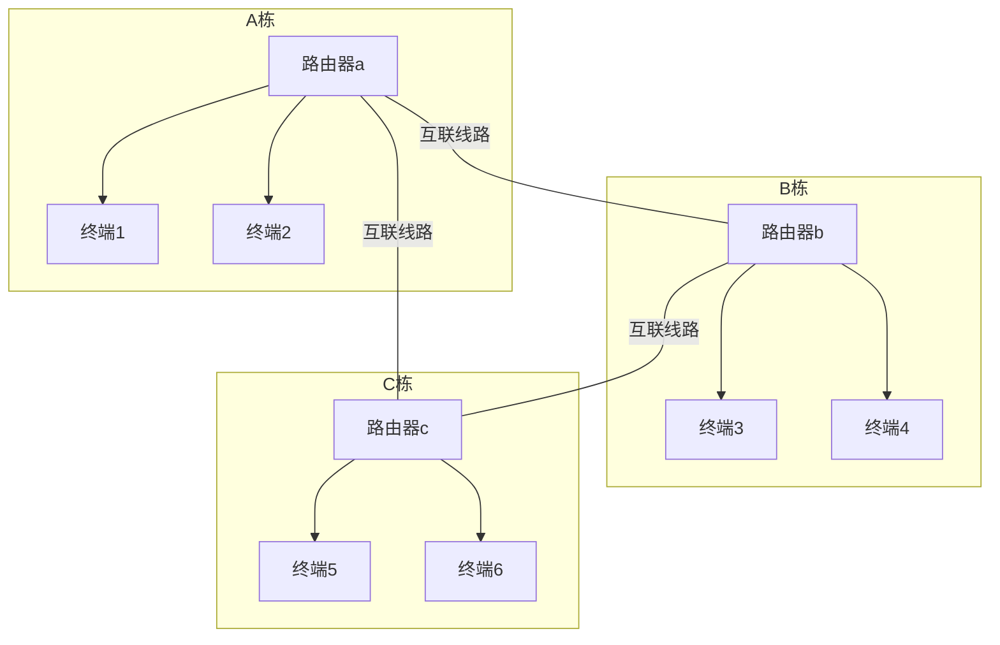
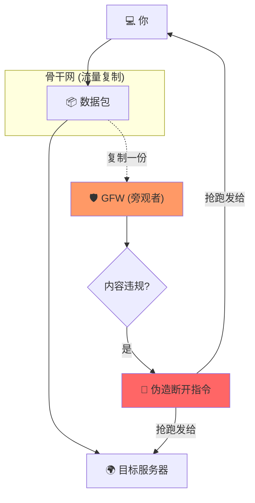

# 背景

事情是这样的，我最近试用了各种AI Chat后发现国产大模型都开始有点呆了，不管是千问、deepseek还是豆包没法满足我的期待。当然这个观点可能不客观，因为有可能只是因为我现在对大模型的期待越来越高了。

我就到处看看有没有其他的模型可以用来满足我日常对话答疑的需求，发现Gemini的口碑不错，而且谷歌那么壕可以白嫖。

激动的打开<https://gemini.google.com/>，发现并不给我使用！各种原因导致Gemini不对中国大陆和香港开放，这下真的切身感受到了被坏老外卡脖子的难受了。


很恼火，但是也不是没有办法。

# 科学上网

因为一些原因，中国大陆对海外的网络访问是受管控的，从国内往海外的内容平台发起网络访问，大概率会被阻断。

## 网际互联

TCP/IP互联网，本质上是无数个自治的局域网，通过路由协议实现互联和路由。

某种意义上我们可以认为中国大陆互联网、欧洲互联网、美洲互联网是3个大局域网，就跟园区里有3栋楼，每栋楼都是一个自治的局域网一样。

然后为了实现楼栋间互联，会通过物理线路(光纤/网线)将3个楼栋的局域网连接起来，借助路由协议实现网际互联。



## 洲际互联

与之呼应的架构就是洲际互联架构，相对楼栋间互联，面临的挑战是距离和带宽！毕竟洲际的通讯容量支撑的是按亿记数的很多人的手机、电脑、服务器。所以中国大陆和欧洲大陆、美洲大陆之间会架设很多海底光缆。


> 比你腰都粗的光缆
{: .prompt-tip }

网上找的大概的洲际互联的光缆线路分布是这样：


> <https://www.submarinecablemap.com/>

可以看到天津啊、上海、深圳这种沿海的重点城市，都会作为光缆接入点，成为洲际网络流量的【海关】。你可以理解成这些光缆都接入到了沿海城市的机房，机房里部署了高性能、高容量的网络转发设备，完成洲际流量转发。

## 数据通关

就像是进出口贸易中所有的集装箱都要经过海关清点，进出中国大陆的所有网络流量也需要经过【防火墙】清点。


> <https://ednovas.xyz/2022/06/25/gfw/#GFW%E7%9A%84%E5%8E%9F%E7%90%86>

大概的流程是：

1. 光缆上的每一个数据包都被复制到GFW的数据中心，进行网络行为分析。
2. 如果是访问【黑名单外】的网站，比如【联合国官网】，那么就不管。
3. 如果是访问【黑名单中】的网站，比如【Facebook】，那么就立即伪造一个tcp reset报文将连接重置，或者直接将数据包丢弃



## 数据代理

到这里我们发现从中国大陆直接访问【黑名单站点】，会被【数据海关】拦截。道高一尺魔高一丈，办法就是找个不在【黑名单】里的服务器做中转。

有点类似转口贸易吧，有点阳澄湖大闸蟹的意思。


因为数据穿过防火墙的时候，防火墙感知到的是不在【黑名单】里的代理服务器，所以不会被拦截。

整个数据流程分两阶段：

1. 中国大陆终端 ----》 代理服务器
代理服务器上会运行代理服务程序，比如socks/frp/clash/v2ray各种的吧，各自是不同的代理报文结构。
终端用户的网络请求，会被【终端代理工具】劫持，然后封装成【代理协议报文】发送到代理服务器。

2. 代理服务器 ----》目标服务器
代理服务器从【代理协议报文】中提取出目标服务和请求内容，将请求发送到目标服务。


## 代理协议

道高一尺魔高一丈，【防火墙】发现大家都开始这么搞代理了，防火墙形同虚设！

于是防火墙在既有的【直连黑名单】的基础上，新增了【代理协议识别】的功能。也就是说，尽管你访问的目标服务器不在【直连黑名单】里，但是深度分析数据协议发现这个可能是一个和代理服务器通讯的代理流量，那么也直接给你拦截掉。

常见的明文代理协议肯定是不用说，直接就被识别和拦截了。即便是基于TLS加密的代理协议，那如果协议设计的不够好，字节序列或交互流程中存在明显的特异性，稍微检查一下、字节模式匹配一下就能明确是某个协议的那种，也很容易被识别和拦截。好像这块的流量检测、识别还用上了机器学习、人工智能啥的。

所以【代理协议】这块一直都很热闹，各种代理协议层出不穷。但是我们不用管那么多细节，我们就有如下两点认知就行：

1. 代理协议就是用来跟代理服务器通讯的数据结构和流程定义，主要就是封装【目标服务】+【请求内容】。
2. 代理协议需要小心的设计，以便隐藏自己的流量特征不被防火墙识别、拦截。

> 引自<https://ednovas.xyz/2022/06/25/gfw/#Shadowsocks>，了解即可。
{: .prompt-tip }

> 常见的代理协议有：
>
>**Shadowsocks**
>
> shadowsocks（ss）是一种基于sock5代理方式的加密传输协议。初代版本发布于2012年4月20日。Shadowsocks使用自行设计的协定进行加密通信。加密演算法有AES、Blowfish、ChaCha20、RC4等，除建立TCP连接外无需握手，每次请求只转发一个连接，无需保持一直连线的状态，因此在流动装置上相对较为省电。
>
> 现如今的该协议的现状是被GFW检测并且可以接着封禁，包括但不限于阻断、封端口、封IP等。所以如果是直连SS的话，基本就是头铁硬刚了。
>
> 因为其低延迟的原因，仍是众多主流机场的选择。（机场都使用中转，并非ss直连，所以封禁对其并无影响）
>
>**shadowsocksr**
>
> 可以说shadowsocksr（ssr/酸酸乳）是ss的升级版。SSR是网名为breakwa11的用户发起的Shadowsocks分支，在Shadowsocks的基础上增加了一些资料混淆方式，称修复了部分安全问题并可以提高QoS优先级。后来贡献者Librehat也为Shadowsocks补上了一些此类特性，甚至增加了类似Tor的可插拔传输层功能。
>
>**VMess**
>
> VMess 是一个基于 TCP 的加密传输协议，所有数据使用 TCP 传输。它分为入站和出站两部分，通常作为 V2Ray 客户端和服务器之间的桥梁。基于v2ray内核。
>
> VMess 依赖于系统时间，请确保使用 V2Ray 的系统 UTC 时间误差在 90 秒之内，时区无关。在 Linux 系统中可以安装ntp服务来自动同步系统时间。
>
> 因为其加密性，现在也是主流加密协议之一。搭建直连节点时主要使用 `vmess + websocket + tls + nginx伪装` 协议，这样理论上是最不容易被墙的协议之一。
>
> vmess协议的主要特点就是严加密，但是随之而来的问题也很明显，握手次数多了，相较于ss/ssr，延迟自然也是提高了很多。但是其速度方面是比ss/ssr要快的（经测试，同服务器ss和vmess+ws的速度比较得出，YouTube也有测速比较视频）。
>
>**Vless**
>
> vless也可以说是vmess的升级版，基于xray内核。VLESS 是一个无状态的轻量传输协议，它分为入站和出站两部分，可以作为 V2Ray 客户端和服务器之间的桥梁。与 VMess 不同，VLESS 不依赖于系统时间，认证方式同样为 UUID，但不需要 alterId。
>
> 相较于vmess，vless的协议速度更快，延迟方面相差不多。
>
>**trojan**
>
> 与Shadowsocks相反，Trojan不使用自定义的加密协议来隐藏自身。相反，使用特征明显的TLS协议(TLS/SSL)，使得流量看起来与正常的HTTPS网站相同。TLS是一个成熟的加密体系，HTTPS即使用TLS承载HTTP流量。使用正确配置的加密TLS隧道，可以保证传输的
>
> Trojan不同于vmess，可以自定是否加上tls加密，trojan是强制使用tls加密的。也就是说trojan必须需要域名才能搭建。
>
> 速度方面，trojan和vmess相差不多。但是trojan最大的优点就是对于服务器端的占用很小，十分的轻量，即使低配服务器也能跑的很爽。
>
>**Hysteria**
>
> Hysteria 是一个功能丰富的，专为恶劣网络环境进行优化的网络工具（双边加速），比如卫星网络、拥挤的公共 Wi-Fi、在中国连接国外服务器等。 基于修改版的 QUIC 协议。
>
> Hysteria这是一款由go编写的非常优秀的“轻量”代理程序，它很好的解决了在搭建富强魔法服务器时最大的痛点——线路拉跨。
>
> 在魔法咏唱时最难的不是搭建维护，而是在晚高峰时期的交付质量。当三大运营商晚高变成了：奠信、连不通、移不动时，你我都有感触。 虽然是走的udp但是提供obfs，暂时不会被运营商针对性的QoS(不开obfs也不会被QoS)。
>
> 这是最近十分火的新协议。主要优点就是即使线路不佳，也不用中转或者CF CDN，使用hysteria即可拯救。目前来看对于非国内优化线路还是十分友好的。

# 代理工具

到这里我们已经知道了，访问一些网站需要【代理工具】和【代理服务器】的支持。

【代理服务器】是生产资料，这个是需要资金运营的，所以一般都是需要找供应商来采购或者自己搭建。比如我们买一个香港机房的虚拟机，在上面部署一个socks-proxy进程，然后我们就用它来转发流量了。

【代理工具】是整个代理链路生效的【最后一公里】。我们需要一个便捷的工具，透明的【劫持+重定向】去往海外的网络流量。

1. 便捷：配置要简单，使用门槛要低，毕竟大部分人网络知识储备并不高。
2. 透明：无论是否使用代理，都不需要来修改应用程序代码。


## 流量劫持

### 1. 系统代理(7层代理)

即便没有洲际网络访问，网络代理也是一个常见需求，因此对于常见的tcp/udp/http流量，其实是有约定俗成的代理支持。

1. tcp/udp代理：[SOCKS代理协议](https://zh.wikipedia.org/wiki/SOCKS)
2. http代理：[HTTP隧道](https://zh.wikipedia.org/wiki/HTTP隧道)

#### 应用设置

一些应用允许单独配置网络代理，比如【飞书】：


#### 全局设置

操作系统也对上述代理模式提供了支持，比如可以在linux上通过环境变量来配置全局的代理服务器，大部分应用程序都会感知和处理这些环境变量。

> Mac/Windows的逻辑也类似，都可以全局的设置

在 Linux 中，最常用的代理环境变量有三个（通常需要同时设置大写和小写以确保兼容性）：

- **`http_proxy`** **/** **`HTTP_PROXY`**：处理普通的 HTTP 流量。
- **`https_proxy`** **/** **`HTTPS_PROXY`**：处理加密的 HTTPS 流量（访问 GPT 主要靠它）。
- **`no_proxy`** **/** **`NO_PROXY`**：设置白名单，指定哪些地址（如 `localhost`、内网 IP）**不走**代理。

**配置示例：**

```shell
# 设置 HTTP隧道
export https_proxy="http://127.0.0.1:7890"
export http_proxy="http://127.0.0.1:7890"
export no_proxy="localhost,127.0.0.1,192.168.0.0/16"

# 设置 SOCKS5 代理（不带用户名密码）
export http_proxy="socks5://127.0.0.1:7891"
export https_proxy="socks5://127.0.0.1:7891"# 有些程序可能识别 socks5h（h 代表域名解析也交给代理服务器，防止 DNS 污染）
export https_proxy="socks5h://127.0.0.1:7891"
```

#### 代理架构


【代理工具】在本地监听一个端口，启动代理服务，同时配置【全局生效】的【系统代理】，利用系统代理来**无感的**劫持tcp/udp/http流量，转发到海外代理服务器。

> 缺点：
> 
> 1. 代理配置的感知、处理是【协作式】的，需要软件开发者在代码中做配套的支持 
> 2. 自定义协议比如游戏服务器如果代码中没有做特别处理则无法生效
{: .prompt-warning }

### 2. 透明劫持(3层代理)

为了让流量劫持更透明，不要上层应用感知和适配，大家慢慢琢磨出了【虚拟网卡】的模式。

#### 虚拟网卡

【代理工具】在终端上利用操作系统特性，用软件模拟出来一张【虚拟网卡】，然后修改【路由表】，将需要劫持、代理的目标IP的流量重定向到【虚拟网卡】，然后再做进一步的封装、转发。


#### TUN设备

Linux/Mac对该使用场景提供了支持，这种模式也是【VPN】的常用实现方案。在 Linux 中，**TUN (Network TUNnel)** 是一种**虚拟网络设备**，它工作在 **TCP/IP 协议栈的第三层（网络层/IP 层）**。


通过【内核态+用户态】两部分打配合，整体流程大概是：

1. **内核层拦截：** 应用程序发出一个 IP 包（比如发往 `api.openai.com`）。
2. **路由重定向：** Linux 内核查看路由表，发现目标IP的路由指向了 `utun`这个虚拟网卡。
3. **用户态处理：** 包进入 TUN 设备后，直接传给用户态的 **VPN 进程**。
4. **代理分发：**这个环节就跟系统代理差不多了，区别主要是VPN程序需要基于3层报文恢复和重建出4层连接，并维护好连接状态机。

> 缺点：
> 
> 1. 虚拟网卡工作在3层，流量中已经丢失了应用层流量细节，比如【域名】。
> 2. 要么就得提前把所有需要劫持的域名对应的ip维护到本机【路由表】中。
> 3. 要么就得配合DNS劫持，利用【fake-ip】机制来提前捕获【域名】。
{: .prompt-warning }

## Clash工具

clash是一个Go语言开发的代理工具，同时支持【系统代理】和【透明劫持】两种方案。它本身是一个命令行工具，类似Nginx，通过配置文件来定制它。

命令行工具的优势是灵活，但是劣势是上手门槛高。所以业界有很多拓展的图形界面软件，把命令行工具封装在里面，提供易用的操作界面。


### 配置文件

clash的配置文件的逻辑是：

1. 有哪些可以用来帮忙转发数据的【代理服务器】
2. 那些特征的请求(域名)需要被代理转发，使用哪个【代理服务器】转发

```yaml
# ==========================================================
# 基础设置 (核心运行环境)
# ==========================================================
port: 7890              # HTTP 代理端口
socks-port: 7891        # SOCKS5 代理端口
allow-lan: false        # 是否允许局域网访问
mode: rule              # 规则模式：根据下面 Rules 部分分流
log-level: info         # 日志级别
external-controller: 127.0.0.1:9090 # 外部控制面板端口
# ==========================================================
# 节点列表 (你的香港 GPT 优化节点)
# ==========================================================
proxies:
  - name: "香港 GPT 优化节点"
    type: ss             # 假设是 Shadowsocks 协议
    server: hk-node.example.com
    port: 443
    cipher: aes-256-gcm
    password: "yourpassword"
    # 原理提醒：该服务器后端已配置了针对 OpenAI 的 WARP 或落地转发

# ==========================================================
# 策略组 (决策大脑)
# ==========================================================
proxy-groups:
  - name: "ChatGPT"
    type: select
    proxies:
      - "香港 GPT 优化节点"

# ==========================================================
# 分流规则 (流量如何路由)
# ==========================================================
rules:
  # 【原理】匹配到 OpenAI 相关域名，丢给优化节点策略组
  - DOMAIN-SUFFIX,openai.com,ChatGPT
  - DOMAIN-SUFFIX,chatgpt.com,ChatGPT
  - DOMAIN-SUFFIX,oaistatic.com,ChatGPT
  
  # 其余流量走默认（或者直连）
  - MATCH,DIRECT
```

> 详见：<https://clash.wiki/configuration/configuration-reference.html>

# Gemini 使用
回到我们最开始的需求，使用如下分流规则即可
```shell
rules:
    - "DOMAIN,gemini.google.com,xxx代理服务器组" # gemini使用新加坡、台湾代理服务器
    - "MATCH,DIRECT" # 其他请求都直连
```

### 数据流转


1. Clash通过【系统代理】劫持网络访问
2. Clash分流
   - Gemini流量交给非HK的代理服务器去转发
   - 非Gemini流量在本地直连
3. Perfect！！！

# 总结

一些不成熟的想法和经验，供各位参考。

# 参考

[ZSH 自动读取 macOS 系统代理配置并设置环境变量](https://blog.skk.moe/post/macos-auto-read-proxy-settings-zsh/)
